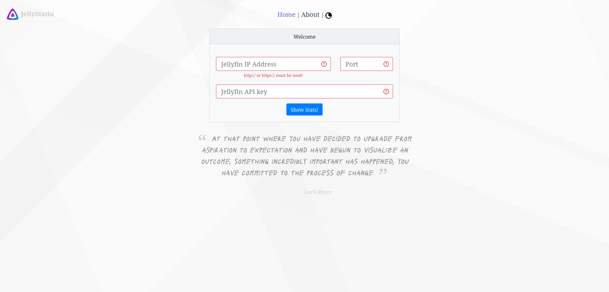
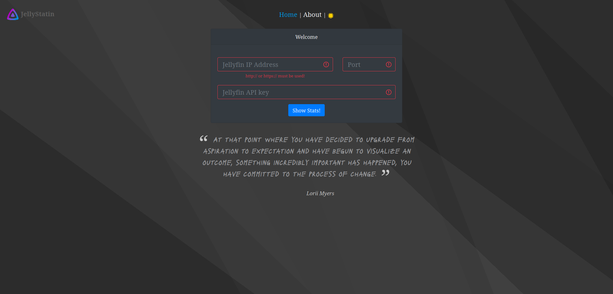
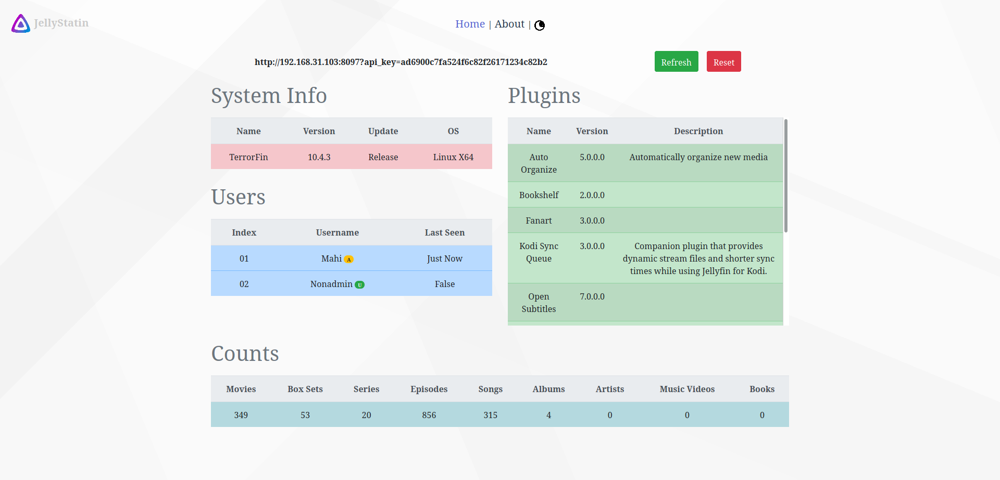
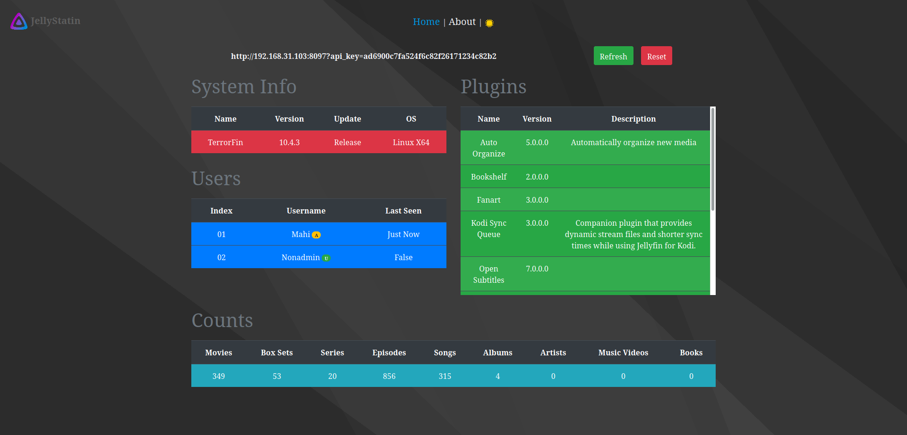
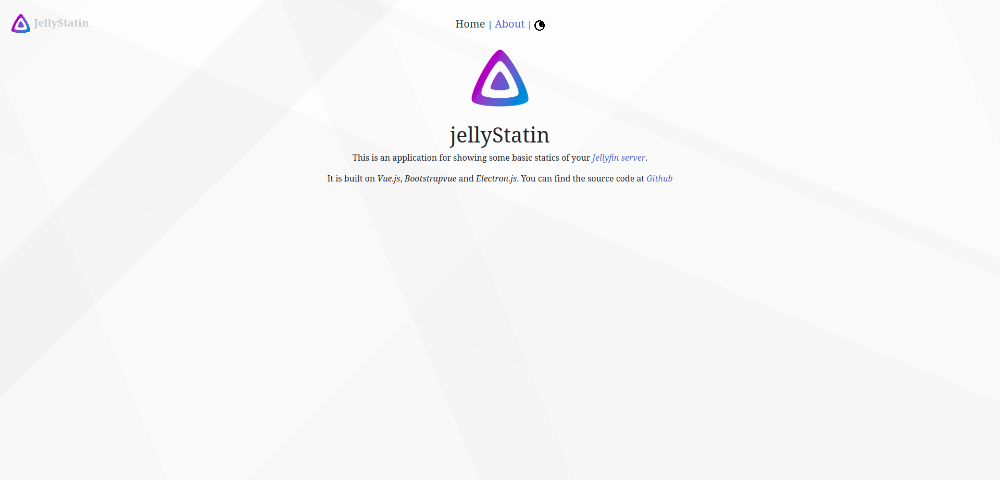
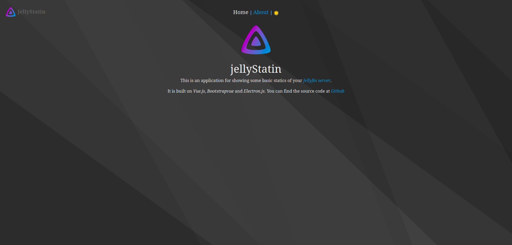

# jellyStat
jellyStat is an aplication to see all types (the goal!) of statistics about your jellyfin server. Uses Vue.JS.

## Reminder
This is a very early stage of an app. It can't do much right now. Only gives some basic data (See SS below). Will be improved over time INSHA ALLAH. peace!

## Project setup steps
```
npm install (installs required packages)
```
```
npm run serve (compiles and hot reload, open with wb browser, http://localhost:8080)
```
```
npm run electron:generate-icons (genarate icons for electron app in dist_electron/icons folder)
```
```
npm run electron:build (builds electron app for your os. ie. .exe in windows, appimage in linux)
```
##Premade Executables (may not be latest)
```
<a href="https://www.dropbox.com/sh/cp5r9bjqkz1yfcs/AAA42rFJOHZ4rwwK3AAVzuVza?dl=0" target="_blank"/>
```
## Screenshots 






